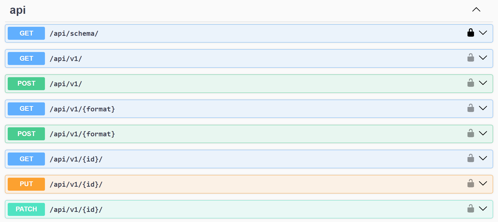
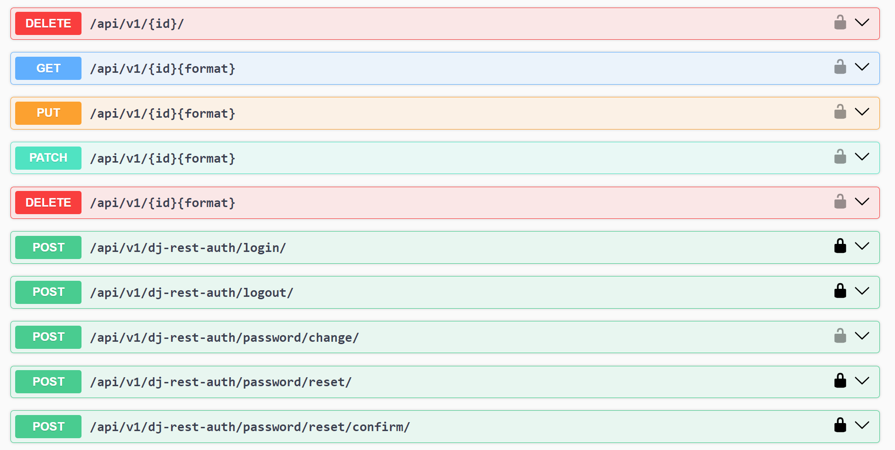
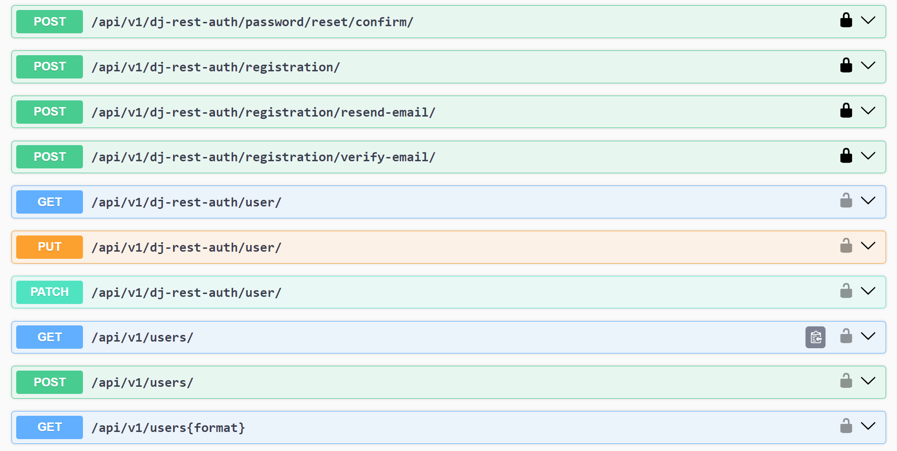
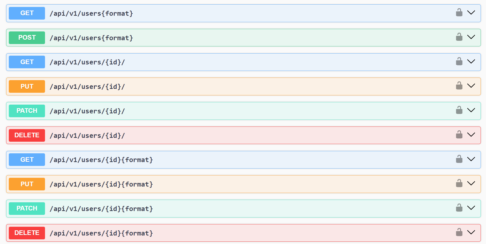
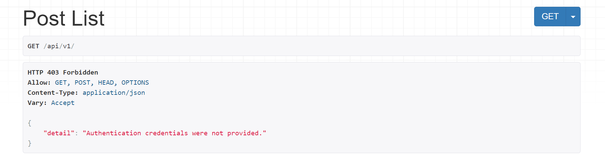
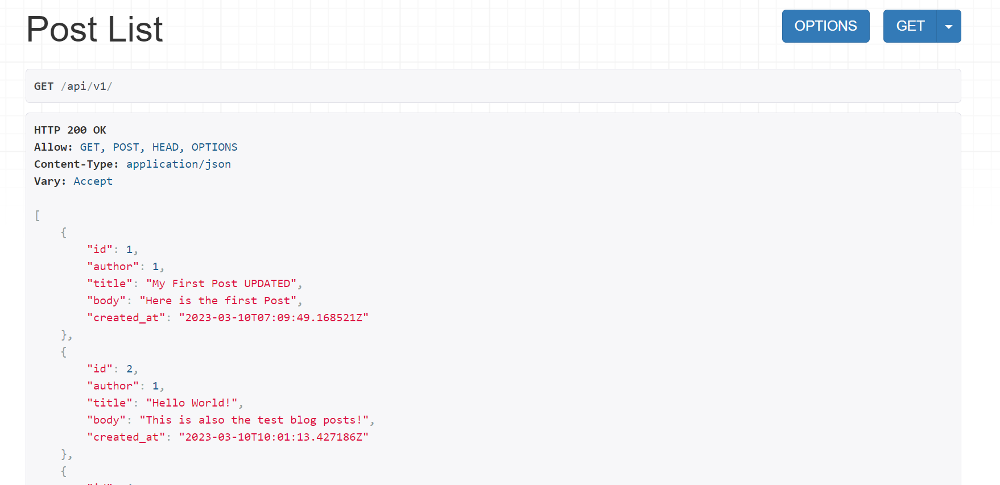
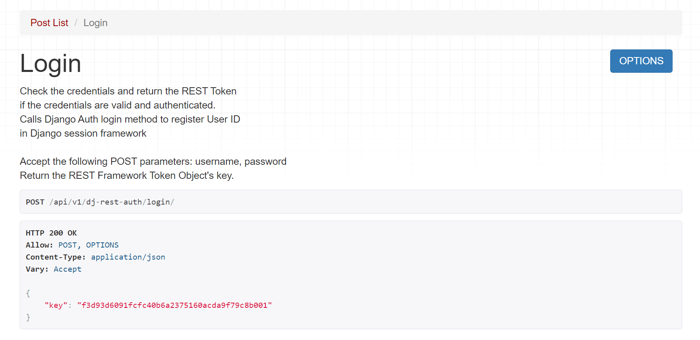
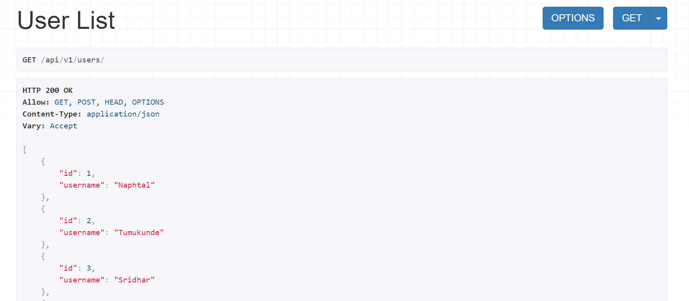

# Django REST API

## Overview

Welcome to the Django REST API, a powerful and flexible solution for managing blog posts and users through a RESTful interface. This API enables you to perform Create, Read, Update, and Delete (CRUD) operations on posts and users with ease.






## Getting Started

### Prerequisites

Before you begin, make sure you have the following prerequisites installed:

- Python (3.x recommended)
- Django
- Django Rest Framework
- Other project-specific dependencies (see [requirements.txt](requirements.txt))

### Installation

1. Clone this repository to your local machine:

   ```bash
   git clone https://github.com/usanaphtal112/Blog-API
   ```

1. Navigate to the project directory:

```bash
   cd Blog-API
```

2. Create and activate a virtual environment (optional but recommended):

```bash
   python -m venv venv
   source venv/bin/activate  # On Windows, use 'venv\Scripts\activate'
```

3. Install project dependencies from requirements.txt:

```bash
   python -m pip install -r requirements.txt
```

4. Apply database migrations:

```bash
   python manage.py migrate
```

5. Create a superuser for the Django admin interface:

```bash
   python manage.py createsuperuser
```

6. Start the development server:

```bash
   python manage.py runserver
```

7. Access the Django admin interface at [Admin](http://localhost:8000/admin/) using the superuser credentials created in step 6 to manage posts and users.

## API Endpoints

The API provides the following endpoints:

# Users

- `POST /api/v1/users/`: Create a new user.
- `GET /api/v1/users/`: List all users.
- `GET /api/v1/users/<int:pk>/`: Retrieve details of a specific user.
- `PUT /api/v1/users/<int:pk>/`: Update a specific user's details.
- `DELETE /api/v1/users/<int:pk>/`: Delete a specific user.

# Posts

- `POST /api/v1/`: Create a new post.
- `GET /api/v1/`: List all posts.
- `GET /api/v1/<int:pk>/`: Retrieve details of a specific post.
- `PUT /api/v1/<int:pk>/`: Update a specific post's details.
- `DELETE /api/v1/<int:pk>/`: Delete a specific post.

## Authentication

Authentication for the API is managed through the Django Rest Framework. By default, the API supports token-based authentication.

## API Documentation

For detailed API documentation, please refer to the following links:

- Swagger UI: [API Documentation](http://localhost:8000/api/schema/swagger-ui/)
- ReDoc: [API Documentation (ReDoc)](http://localhost:8000/api/schema/)

## Screenshots





